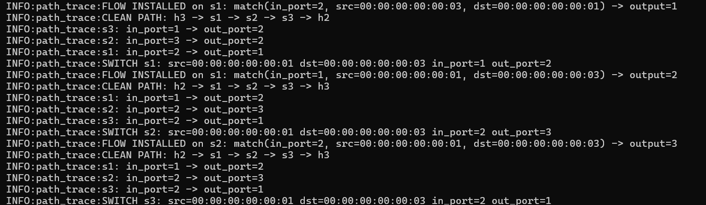
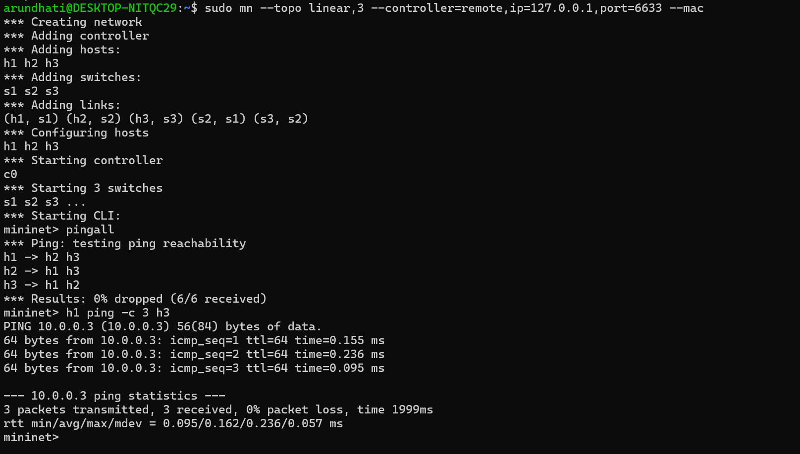
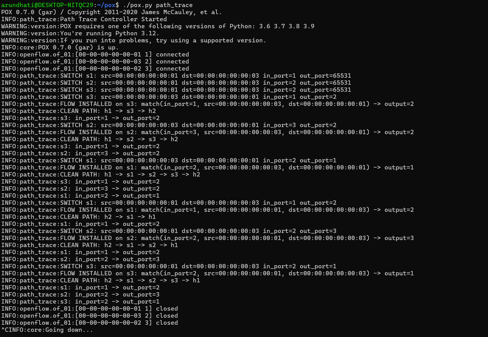
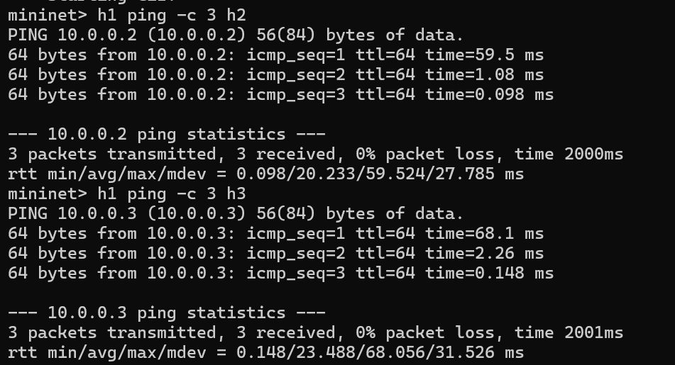
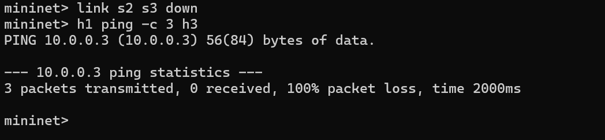
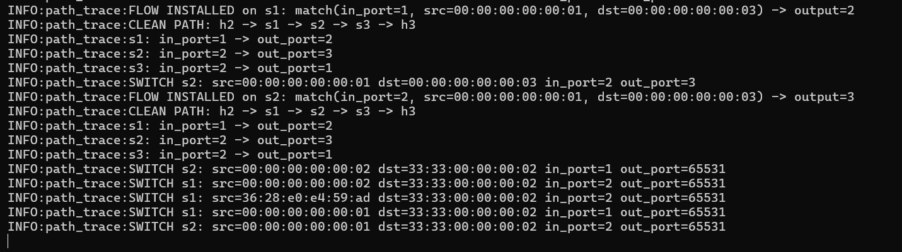
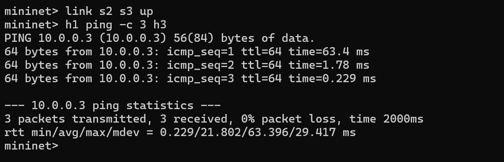
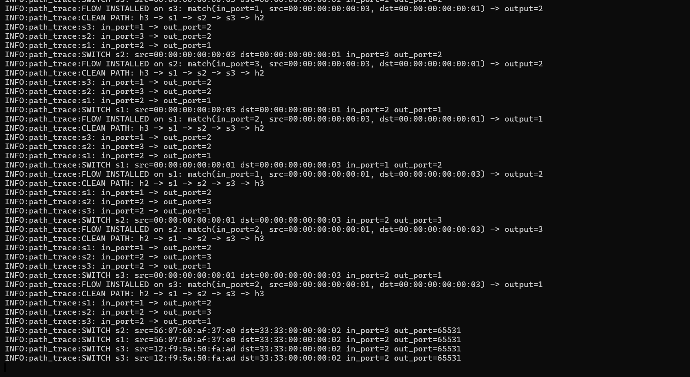
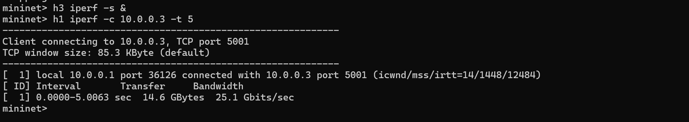
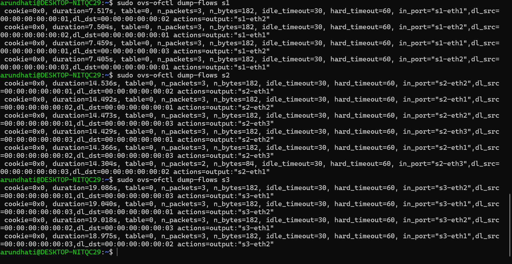

# SDN-Based Path Tracing using POX and Mininet

---

## 1. Problem Statement

Traditional networks rely on distributed and static control, making it difficult to dynamically manage packet flow. Software Defined Networking (SDN) separates the control plane from the data plane, enabling centralized control.

This project implements an SDN-based path tracing system using POX and Mininet. The controller dynamically installs flow rules, traces packet paths, and handles network changes like link failures.

---

## 2. Objective

- Implement SDN controller using POX  
- Handle packet_in events  
- Install flow rules dynamically  
- Trace packet paths across switches  
- Simulate link failure and recovery  
- Measure performance using ping and iperf  

---

## 3. Topology

Linear topology:

```
h1 --- s1 --- s2 --- s3 --- h3
               |
               h2
```

## 4. Setup / Execution Steps

### Start Controller
cd ~/pox  
./pox.py path_trace  

### Start Mininet
sudo mn --topo linear,3 --controller=remote,ip=127.0.0.1,port=6633 --mac  

### Test Connectivity
pingall  
h1 ping -c 3 h2  
h1 ping -c 3 h3  

### Link Failure
link s2 s3 down  
h1 ping -c 3 h3  

### Restore Link
link s2 s3 up  
h1 ping -c 3 h3  

### iperf Test
h3 iperf -s &  
h1 iperf -c 10.0.0.3 -t 5  

### Flow Tables
sudo ovs-ofctl dump-flows s1  
sudo ovs-ofctl dump-flows s2  
sudo ovs-ofctl dump-flows s3  

---

## 5. Expected Output

- Controller logs show flow installation  
- pingall → 0% packet loss  
- h1 to h3 works normally  
- Link failure → 100% packet loss  
- Link recovery restores connectivity  
- iperf shows bandwidth  
- Flow tables show installed rules  

---

## 6. Proof of Execution

### Controller Output


---

### Ping Results
  


---

### Packet Transmission


---

### Link Failure

Command:
link s2 s3 down  

Result:
- h1 cannot reach h3  
- 100% packet loss  

  


---

### Link Recovery

Command:
link s2 s3 up  

Result:
- Connectivity restored  

  


---

### iperf Output


---

### Flow Tables


---

## 7. Conclusion

This project demonstrates SDN-based control using POX, including dynamic flow rule installation, path tracing, and handling of network failures and recovery. Performance testing using ping and iperf validates correct forwarding behavior.
